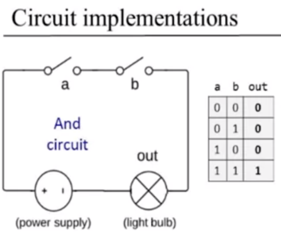
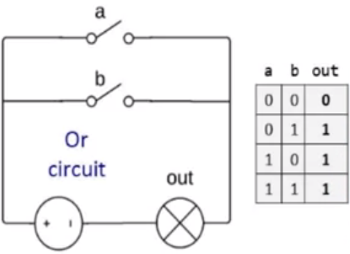

### We can use simple gates and combine them with composite gates

### Interface answers the question WHAT?
### One abstraction => many ways to implementation

### We can use circuit implementation to show how it works with, for example electricity perspective

*AND* 

*OR*
