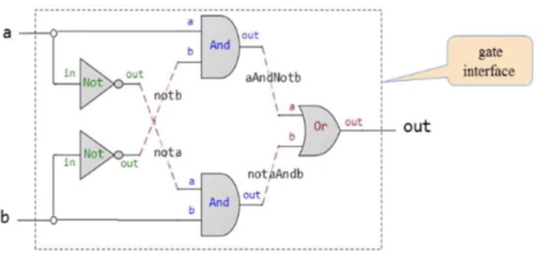

## Gate XOR implementation diagram



What is outside of the boundary (dash border) is the user's view or the gate interface.


So to use formal language HDL has unlimited thin out.
You can, you can thin out any given signal to as many destinations as you want.

Connections between the gates should be with named.

In HDL, we basically describe how gates connection with paths:
```
/* XOR gate: out = (a And Not(b)) or (Not(a) And b) */ 

CHIP Xor{
    IN a,b;
    OUT out;

    PARTS:
    Not(in=a, out=nota);
    Not(in=b, out=notb);
    And(a=a,b=notb, out=aAndNotb);
    And(a=nota, b=b, out=notaAndb);
    Or(a=aAndNotb, b=notaAndb, out=out);
}
```

### HDL file is a textual description of implementation diagram